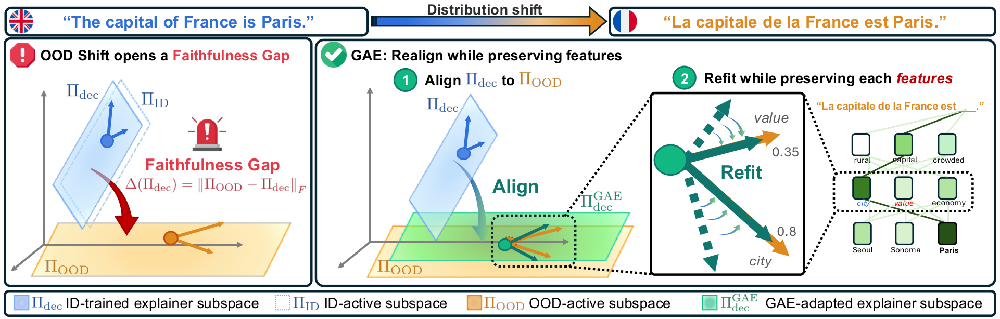

# Geometry-Adaptive Explainer (GAE)

<p align="center">
  
</p>

**Restoring explanation faithfulness under distribution shift, training-free.**

[](LICENSE)


> Official implementation accompanying our paper *Geometry-Adaptive Explainer (GAE)*.  
> **Authors:** Sungjun Lim, Heedong Kim, Andrew Lee\*, Kyungwoo Song\* (\*corresponding).  
> <!-- TODO(public-release-G1): add arXiv link when available -->

---

## TL;DR

- Dictionary-based explainers (transcoders, sparse autoencoders) lose faithfulness under distribution shift.
- We identify the cause as a geometric misalignment between the ID dictionary and the OOD-active subspace (the **faithfulness gap**), and bound the OOD-faithfulness loss by it.
- **GAE** closes this gap training-free: Procrustes-align the dictionary with the OOD-active subspace, then closed-form refit the decoder on unlabeled OOD activations. No gradients, no labels.

---

## Installation

```bash
git clone https://github.com/MLAI-Yonsei/GAE.git && cd GAE
conda create -n gae python=3.10 -y && conda activate gae
pip install -r requirements.lock     # exact versions used in the paper
# or: pip install -r requirements.txt   # loose constraints
```

Set up data paths once:

```bash
cp .env.example .env
# Edit .env — REPO_DATA and DATA_ROOT default to ./data; HF_TOKEN is optional
source .env
```

---

## Quickstart

Reproduce GAE on the smallest setting (≈ 30 min on a single A100):

```bash
# 1. Train the ID explainer (Top-K SAE on GPT-2)
bash scripts/train_id/train_sae_topk.sh 0 gpt2

# 2. Evaluate GAE on Temporal OOD
bash scripts/timeshift_ood/gae.sh 0 gpt2
```

Results land in `results/timeshift_ood_gpt2_sae_fineweb_gae.json` with nAOPC, nComp, and |ΔCE|.

---

## Reproducing the Paper Results

One script per (setting × baseline) cell. To sweep all baselines for one model:

```bash
for setting in adv_ood domain_ood timeshift_ood; do
  for baseline in fixed term ood_finetuned ood_retrained saeboost faithfulsae gae; do
    bash scripts/$setting/$baseline.sh 0 gpt2
  done
done
```

Each script takes positional args `<DEVICE> <MODEL> [<OOD_SET>]`; defaults are set inside each script.

**Reference platform:** NVIDIA A100 80 GB.  
**Wall time per cell:** ≈ 30 min (GPT-2), 3–4 h (Pythia-1.4B).  
**Batch size defaults:** GPT-2 256, Pythia-1.4B 64 (reduce `--batch_size` if needed).

Each run writes a JSON to `results/` with three causal-faithfulness metrics:

| Metric | Direction | Definition |
|---|---|---|
| **nAOPC** | ↑ | Avg. normalized logit drop over budgets `M = [1,2,4,8,16,32,64,128]` |
| **nComp** | ↑ | Normalized logit drop at `m* = 32` |
| **\|ΔCE\|** | ↓ to 0 | Cross-entropy change at full-reconstruction replacement |

Implementation: `ood_utils/evaluation.py`. Seed: `2026`, evaluation at `pos=-1`.

---

## Repository Layout

```
GAE/
├── run_experiment.py          # main runner — CLI dispatch for all OOD settings and baselines
├── gae.py                     # GAE algorithm (Procrustes alignment + closed-form decoder)
├── saeboost.py                # SAEBoost residual booster baseline
├── train_explainers.py        # ID-explainer training (Transcoder, Top-K SAE, TERM, FaithfulSAE)
├── utils.py                   # activation / model / text / training-objective utilities
├── config.py                  # global config (layers, dict sizes, env-var defaults)
├── ood_utils/                 # dataset loaders + evaluation metrics
├── sae_training/              # SAELens-based training utilities
├── scripts/
│   ├── train_id/              # ID-explainer training entrypoints
│   ├── adv_ood/               # Adversarial OOD (HaluEval, JailbreakHub)
│   ├── domain_ood/            # Domain OOD (Edgar, patents, govreport)
│   └── timeshift_ood/         # Temporal OOD (FineWeb, Dolma)
├── assets/                    # static media (figures, etc.)
└── requirements.{lock,txt}
```

Default mid-layer (`config.py`): GPT-2 `L=8`, Pythia-1.4B `L=15`. Evaluation at last token (`pos=-1`).

---

## Method at a Glance

GAE adapts a dictionary explainer to OOD in two training-free steps (paper §4):

1. **Procrustes alignment** — rotate the dictionary's reference subspace to the OOD-active subspace, estimated as the top-`r` eigenspace of the OOD activation covariance.
2. **Closed-form decoder** — within the aligned subspace, refit the decoder via a closed-form ridge solution on unlabeled OOD activations.

No gradient updates, no labels — only an unlabeled OOD activation pool.

---

## Authors

- Sungjun Lim — Yonsei University (`lsj9862@gmail.com`)
- Heedong Kim — Yonsei University
- Andrew Lee\* — Harvard University (`andrewlee@g.harvard.edu`)
- Kyungwoo Song\* — Yonsei University (`kyungwoo.song@gmail.com`)

\* corresponding authors

## Citation

If you use this code, please cite:

<!-- TODO(public-release-G1): update title, authors, and venue once finalized -->
```bibtex
@inproceedings{lim2026gae,
  title  = {<paper title>},
  author = {Lim, Sungjun and ...},
  year   = {2026},
  note   = {Preprint / venue TBD}
}
```

## Contact

Questions and issues: please open a GitHub issue or contact
Sungjun Lim (`lsj9862@gmail.com`).

## License

This code is released under the Apache 2.0 License. See
[`LICENSE`](LICENSE) for the full text.

## Acknowledgements

We thank the maintainers of [TransformerLens](https://github.com/TransformerLensOrg/TransformerLens)
and [SAELens](https://github.com/jbloomAus/SAELens), on which this
codebase depends.
